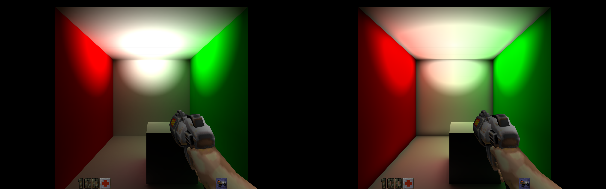
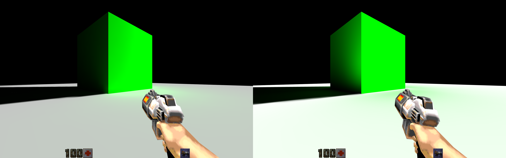

# optixlight

This is a tool for adding bounced light into Quake 2 BSP files.  It takes a bsp
file lit with direct light from another compiler (eg. ericw-tools), and then
uses path tracing to simulate light being bounced multiple times from this
direct source.  Rays are traced using the Optix API and require a supported (eg.
NVIDIA RTX) card to work.

## Screenshots

optixlight (left) vs ericw-tools (right)

optixlight (left) vs ericw-tools (right)

## Setup

Instructions for running on Linux.

- Download and install the Optix SDK from the NVIDIA.  Tested with version
  7.6.0.
- Set up a conda environment as per the
  [instructions here](https://github.com/NVIDIA/otk-pyoptix#conda-environment)
  however do not download or install the NVIDIA/otk-pyoptix repo.
- Instead, we'll be using a third party Optix wrapper.  Pip install the
  [mortacious/python-optix repo](https://github.com/mortacious/python-optix) as
  per the instructions there.
- Install the [pyquake repo](https://github.com/matthewearl/pyquake) by
  cloning the repo and running `pip install -e <path to repo>`.
- Use ericw-tools (or another tool) to compile your map with direct lighting
  only (`-bounce 0`).
- Clone this repo and cd into it.
- Run `python -m optixlight.optixlight <game dir> <input BSP file> <output BSP file>`
  to add bounced lighting into the map.  The game dir is used to find textures
  from `<game dir>/textures/<tex name>.wal`.  Currently only wal files are
  supported, and textures must not be inside pak files.
